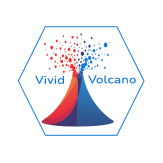

# Vivid - volcano 

#### Vivid-Volcano is a Shiny application designed for the visualization  and exploration of preprocessed omics data. It enables easy creation of  highly customizable, publication-ready volcano plots, comprehensive data  exploration, and gene ontology (GO) enrichment analysis. The primary  goal of the app is to provide an average biologist, with little to no  bioinformatics background, an intuitive tool for exploring and  visualizing their preprocessed omics data. Users can download variously  formatted publication-ready plots and neatly formatted tables that  adhere to scientific standards.

#### Key Features:

• Upload user data in TSV/CSV format or use the provided demo data\
• Interactive preview of the uploaded data table\
• Server-friendly binary format for gene ontology data\
• Five methods for p-value adjustment with different statistical thresholds\
• Highlighting and counting of regulated genes with custom-colored labels\
• Visualization of GO categories on the plot with custom-colored labels\
• Customization of arbitrary gene labels\
• Optional trimming of multiplied gene names\
• Labeling of selected genes of interest\
• Server-side processing and browsing of more than 8,000 GO categories from a binary file\
• Customization of axis and title labels\
• Creation of gene ontology enrichment analyses with results in a professionally formatted table (optional PDF output)\
• Table of gene lists for each GO category, enabling easy identification of detected and regulated genes within a specific category (optional PDF output)\
• Process log system for user sessions, useful for checking data processing outcomes, debugging, and analyzing app functionality

The application in availible in the web:

XXXXXXXXXXXXXXX

For running the app locally follow the Instructions:

1.   Clone this repository:\
    git clone <https://github.com/DatViseR/Vivid-Volcano.git>

2.   Change directory:\
    cd Vivid-Volcano

3.   Run the app in R:\
    Rscript -e "shiny::runApp()"

Contributions are welcome! Please fork the repository and submit a pull request.

# LICENCE:

The Vivid volcano application is available under a dual-license model:

## Non-Commercial Use (AGPL-3.0)

-   Free for academic, research, and non-commercial use
-   Subject to the terms of the GNU Affero General Public License v3.0
-   Any modifications must be shared back with the community
-   Source code must be made available when the software is used over a network

Copyright (C) 2025 Tomasz Stępkowski

```         
This program is free software: you can redistribute it and/or modify
it under the terms of the GNU Affero General Public License as published by
the Free Software Foundation, either version 3 of the License, or
(at your option) any later version.

This program is distributed in the hope that it will be useful,
but WITHOUT ANY WARRANTY; without even the implied warranty of
MERCHANTABILITY or FITNESS FOR A PARTICULAR PURPOSE.  See the
GNU Affero General Public License for more details.

The copy of the GNU Affero General Public License is availible from https://www.gnu.org/licenses/.
```

## Commercial License

For commercial use, please contact me to obtain a commercial license. A commercial license is required if you want to:

\- Use the software in a commercial product or service

\- Modify the software without sharing the changes

\- Integrate the software into proprietary solutions

\- Avoid the AGPL-3.0 requirements

For commercial licensing inquiries, please contact: - Email: dzdzstepel\@gmail.com
